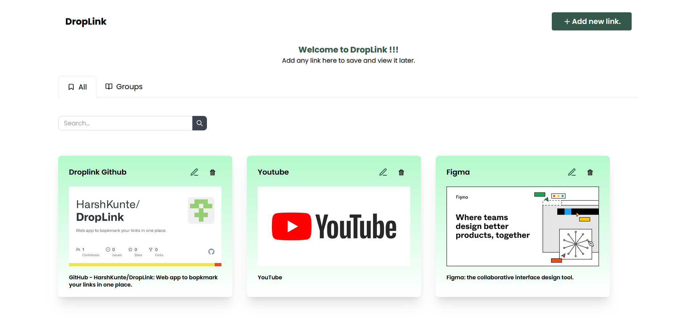
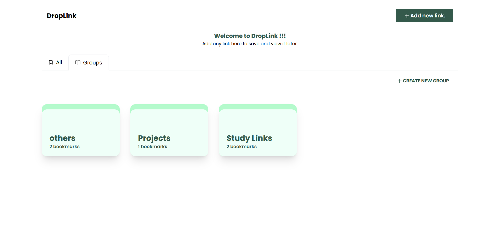
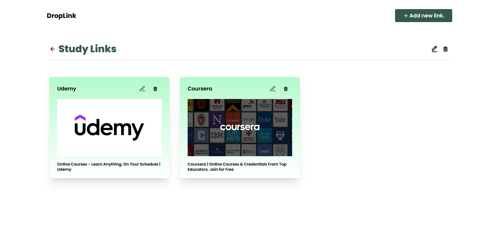

# DropLink 
## A Website to Bookmark and Save Links

DropLink is a simple and intuitive website that allows you to bookmark and save links. It's built using HTML, Tailwind CSS, and React JS, making it easy to use and customize.

With DropLink, you can easily save links to your favorite websites, articles, and resources, and access them quickly and easily. The website is responsive and optimized for both desktop and mobile devices, so you can use it on the go.

## Check Live 🌐
You can check this website live [here](https://droplink.netlify.app/)

## Features 🎯

- Add new bookmarks with just a few clicks
- Categorize bookmarks to different groups
- Edit and delete existing bookmarks
- Search and filter bookmarks by name or URL
- Save bookmarks to local storage for easy access
- Responsive design optimized for desktop and mobile devices

## Preview 🖼️





## How to Use 🧑‍💻

- Clone the repository to your local machine
- Install dependencies using npm install
- Run the website using ```npm start```
- Open your browser and navigate to http://localhost:3000


## Made By
Harsh Kunte